   

<h1 align="center">Hi 👋, I'm Walter Nascimento Barroso</h1>
<h3 align="center">Passionate about technology</h3>

 🤝🏻 &nbsp;Connect with Me: 

 🛠 &nbsp;Tech Stack 

  
  
  
  
  
  
  
  
  
  
  
  

 ⚡ &nbsp;Github Stats: 

&nbsp;

 🔭 &nbsp;Quote: 

***

Made with &nbsp;❤️&nbsp;
